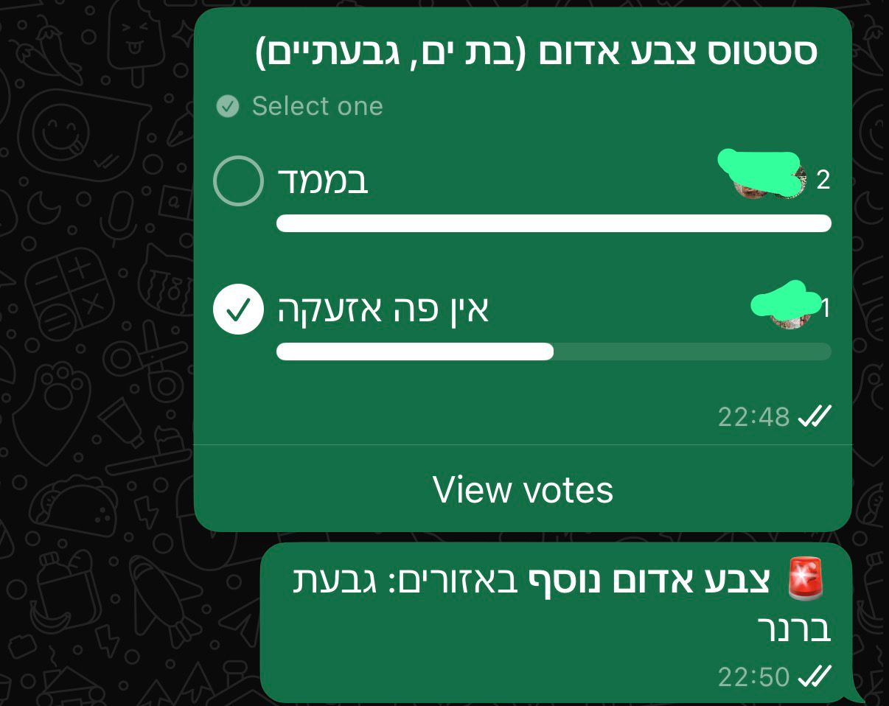

# Auto Redalert Poll

A Node.js tool using TypeScript that automatically monitors the Pikud Haoref (Home Front Command) API for red alerts in specified areas, and instantly sends a WhatsApp poll to a target group or chat to check on everyone.


## Features
- Monitors specific areas for red alerts in real-time.
- Automatically sends a WhatsApp poll to your designated group/chat when an alert occurs.
- Implements a cooldown mechanism to prevent spamming during continuous events.
- Easy to configure through environment variables.

## Prerequisites
- [Node.js](https://nodejs.org/) (v18 or higher recommended)
- A WhatsApp account to link the bot

## Installation

1. Clone or download this repository.
2. Open a terminal in the project directory.
3. Install the dependencies:
   ```bash
   npm install
   ```
4. Copy the example environment file to create your own configuration:
   ```bash
   cp .env.example .env
   ```
5. Open the `.env` file in any text editor and configure your variables:
   - `TARGET_CHAT_ID`: The ID of the WhatsApp chat or group.
     - **Tip: You can leave this blank!** The app has an interactive setup that will show your recent chats and configure this automatically when you run it.
     - For manual entry: individuals look like `1234567890@c.us`, groups look like `1234567890-12345@g.us`.
   - `AREAS_TO_MONITOR`: Comma-separated list of areas to monitor (e.g., `תל אביב - יפו,רמת גן`).
   - `POLL_INTERVAL`: API polling interval in milliseconds (default is `2000`).
   - `EVENT_SILENCE_MINUTES`: Time in minutes of silence required to consider an event ended (default is `10`).

## Usage

1. Start the application:
   ```bash
   npm start
   ```
2. **First Time Setup**: The first time you run the app, it will take a few seconds and then display a large QR code in the terminal.
3. Open WhatsApp on your phone, go to **Settings** -> **Linked Devices** -> **Link a Device**, and scan the QR code.
4. **Quick Auto-Setup**: If you left `TARGET_CHAT_ID` empty, simply open WhatsApp on your phone and send the message `!here` to the connected account (either via direct message or from within the group you want to monitor). The app will instantly capture the Chat ID and automatically save it to your `.env` file!
5. Once authenticated and configured, the bot will start monitoring for alerts!

## Troubleshooting

- **QR Code isn't showing or expired:** Stop the process (`Ctrl + C`) and restart the app (`npm start`) to generate a new QR code.
- **WhatsApp won't connect / session issues:** Delete the `.wwebjs_auth` and `.wwebjs_cache` folders in the project directory, then run `npm start` again to force a fresh, clean login.
- **Bot isn't sending messages but connects successfully:** Double-check your `TARGET_CHAT_ID` in the `.env` file. Group IDs must end in `@g.us` and individual direct chats must end in `@c.us`.
- **Alerts aren't being detected:** Make sure you've spelled the areas correctly in `AREAS_TO_MONITOR`, matching the exact official Pikud Haoref area names in Hebrew.
- **API Connection Errors:** The Pikud Haoref API is generally only accessible from Israeli IP addresses. If you are hosting this on a cloud provider outside of Israel, it may be blocked.
